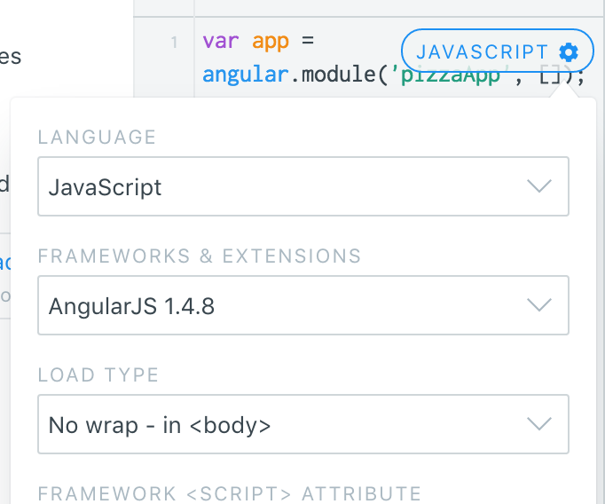

Understanding Isolate Scope

Please follow along by using JSfiddle. (need link)

Understanding scope for directives is important to understand how your app works as it scales. To better explain how scope works, lets start by creating an “ovenApp” with an “oven” directive that’s restricted to an element. We’re going to bake some pizzas so lets use a template that has an input and ng-model=”pizza” that displays the type of pizza after the input.

Type this out in the JavaScript box of your fiddle. Be sure to select “AngularJS 1.4.8” or above, and set the Load Type to “No wrap - in \<body\>" as in Figure 1.



Figure 1\.

```js
var app = angular.module('ovenApp', []);

app.directive("oven", function() {
  return {
    restrict: "E",
    template: '<input type="text" placeholder="Topping" ng-model="pizza"> {{pizza}} pizza'
  };
});
```

Now lets use our directive in our app:

```js
<div ng-app="ovenApp">
  <oven></oven>
</div>  
```

Try it out here <https://jsfiddle.net/pdzeLjg5/>

I don’t know about you, but I like a lot of pizza so lets add a few more ovens to bake more!

```js
<div ng-app="ovenApp">
  <oven></oven>
  <oven></oven>
  <oven></oven>
</div>  
```

Now hit “run” on the fiddle and type in a pizza. Type in a pizza type and you’ll see that all the ovens are being told to bake the same pizza. What’s going on here is that the directives are sharing the same scope. To “isolate” their scope, we need to provide our directive with an empty object on the scope so they won’t share bindings.

```js
app.directive("oven", function() {
  return {
    restrict: "E",
    scope: {},
    template: 'Topping <input type="text" placeholder="Topping" ng-model="pizza"> {{pizza}} pizza'
  };
});
```

Now we’re able to specify different pizzas and we can see that the binding works, but it’s limited to each individual directive. An empty scope doesn’t allow for interaction with a controller. For example lets say we wanted to keep a log of the pizzas that are baked:

```js
app.controller("PizzaCtrl", function($scope){
  $scope.logPizza = function(pizza){
    alert(pizza + " pizza is baked!");
  };
});
```

And we need to update our directive:

```js
div ng-app="ovenApp">
  <div ng-controller="PizzaCtrl">
    <oven bake="logPizza(pizza)"></oven>
  </div>
</div>
```

To wire up our logPizza function and “bake” binding (correct?), we need to set the scope object within the directive to an ampersand (&) for an expression. We’ll also change the template to include a button and a ng-click attribute.

```js
app.directive("oven", function() {
  return {
    restrict: "E",
    scope: {
        bake: "&"
      },
    template: '<input type="text" placeholder="Topping" ng-model="pizza">' +
      '{{pizza}} pizza' +
      '<button type="button"  class="button" ng-click="bake({pizza: pizza})">Bake!</div>'
  };
});
```

The {pizza: pizza} syntax maps the pizza from the model in the input to be passed to the logPizza function

Here’s the completed code: <https://jsfiddle.net/qvbjkn3L/25/>


